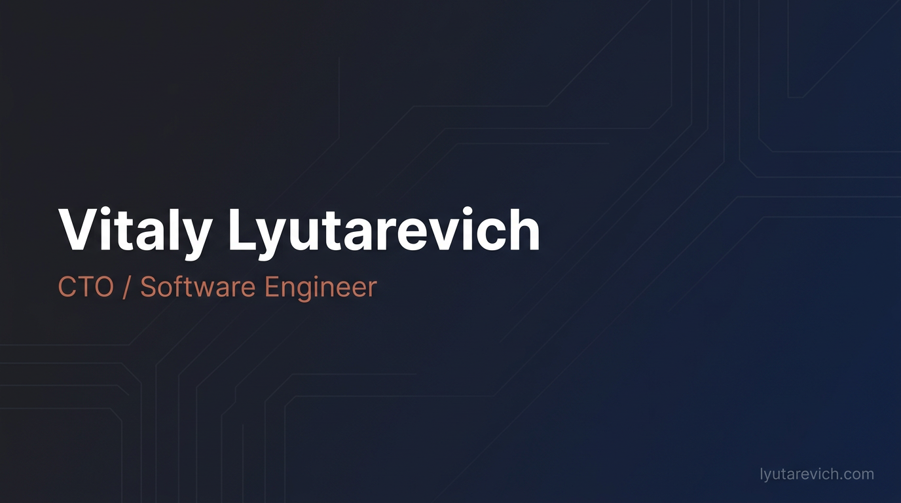

# Vitaly Lyutarevich

**CTO at [Dats.Team](https://dats.team)** — 2 000+ people, 32 countries, high-load SportTech & AdTech products.
Junior Java → CTO in 7 years. I still write code.

---

### About me

- CTO overseeing 6 products and 30+ engineers across SportTech, AdTech, video streaming, and web scraping
- Architected a high-load sports data platform from scratch — real-time microservices processing live events at scale
- Grew 4 team leads from individual contributors; founded a JVM Community of Excellence (70+ members)
- Write and speak on engineering culture, AI adoption in teams, trunk-based development, and incident management
- MSc in Computer Science (Information Security) · PSM I · [Stratoplan CTO School](https://stratoplan.ru/) graduate

---

### Tech stack

#### Languages

#### Backend & Frameworks

#### Infrastructure & Tools

---

### GitHub stats

  
  &nbsp;&nbsp;
  

  

---

### Featured projects

<table>
  <tr>
    <td width="50%" valign="top">
      <h3><a href="https://github.com/Samehadar/ai-team-metrics">ai-team-metrics</a></h3>
      
Browser-local analytics dashboard for tracking <strong>Cursor IDE</strong> usage across a dev team. Adoption metrics, per-developer patterns, heatmaps, PDF export. Chrome extension included.

      
React · TypeScript · Recharts · Tailwind CSS · Chrome Extension (MV3)

    </td>
    <td width="50%" valign="top">
      <h3><a href="https://github.com/Samehadar/samblog">samblog</a></h3>
      
Multilingual personal blog (EN / RU / PL) deployed at <a href="https://lyutarevich.com"><strong>lyutarevich.com</strong></a>. Dark-mode-first, privacy-friendly analytics, RSS feeds, reading-time estimates.

      
Astro 6 · Vue 3 · Tailwind CSS 4 · MDX

    </td>
  </tr>
</table>

---

### Writing & Talks

Recent articles on [lyutarevich.com](https://lyutarevich.com):

- [AI Shift in Engineering: Motivation, Security, and First Purchases](https://lyutarevich.com/ru/blog/ai-shift-in-engineering/) — rolling out AI tools (Cursor, Claude) across an engineering org
- [Incident Management Process](https://lyutarevich.com/ru/blog/incident-management-process/) — on-call, SLA, triage, and traceability in a product team
- [MyQuestions.txt](https://lyutarevich.com/ru/blog/my-questions-txt/) — career growth reflections: from toxic mentorship to learning with AI

Conference talks:

- **Fundamental Responsibility of a Team Lead** — what really happens in people's heads (Dats.Team Workshop)
- **Improving Testing Quality with Trunk-Based Development** — practices and culture (Dats.Team Conference, Bishkek)
- **Community of Practice & the Aeilus Methodology** — building cross-team knowledge sharing (Dats.Team Mono-Meetup)

---

  <a href="https://lyutarevich.com">lyutarevich.com</a> · <a href="https://www.linkedin.com/in/lyutarevich/">LinkedIn</a> · <a href="https://t.me/lyutarevich">Telegram</a>

